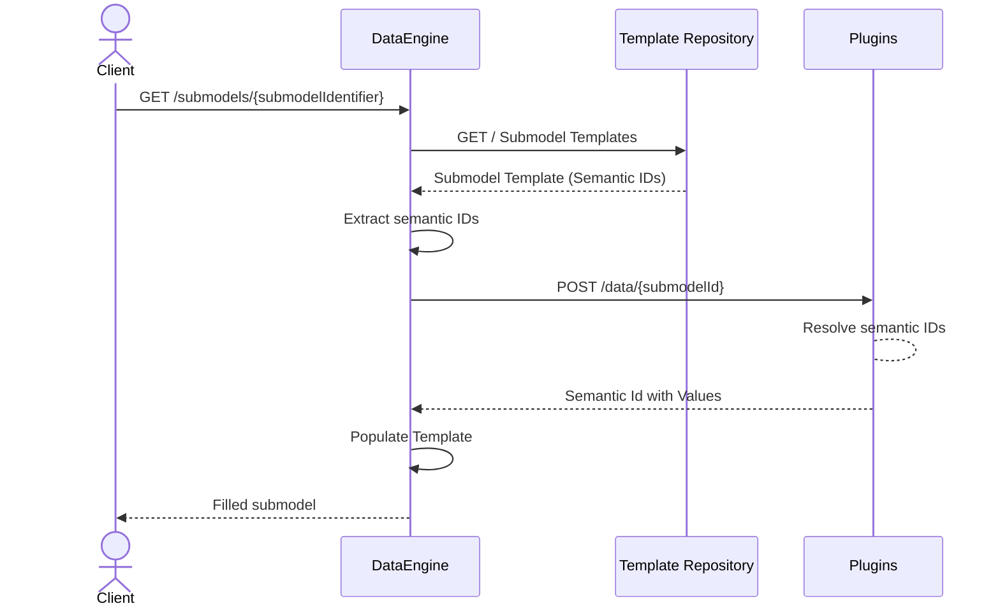

# DataEngine

[](https://www.mm-software.com/)
[](https://www.apache.org/licenses/)
[](https://learn.microsoft.com/en-us/aspnet/core/web-api/?view=aspnetcore-10.0&WT.mc_id=dotnet-35129-website) 

## Overview

## DataEngine Overview

**DataEngine** is an API service that dynamically generates complete **Asset Administration Shell (AAS) submodels** by combining standardized AAS templates with provided data from database via plugins.

It acts as the **core orchestration layer** in the TwinEngine ecosystem, transforming static AAS templates into **live, ready-to-consume AAS representations** through a **plugin-based value resolution mechanism**.

DataEngine integrates seamlessly with **Eclipse BaSyx** components and is also capable of orchestrating other **open-source AAS-related components**, enabling a **flexible, vendor-neutral AAS infrastructure**.

---

## Features Overview

- **Template-based Dynamic AAS and Submodel Generation**  
  Dynamically builds complete AAS structures using standardized, reusable templates (containing semantic IDs without values).
    - For more info : [Template-driven submodel generation](https://github.com/AAS-TwinEngine/AAS.TwinEngine.DataEngine/wiki/Feature-Overview#template-driven-submodel-generation)

- **Schema-driven Plugin Integration**  
  Decouples data access through external Plugin APIs using JSON Schema contracts for type-safe communication.
    - For more info : [Plugin-based value resolution](https://github.com/AAS-TwinEngine/AAS.TwinEngine.DataEngine/wiki/Feature-Overview#plugin-based-value-resolution)

- **IDTA-aligned AAS REST Endpoints**  
  Multiple API endpoints that align with official IDTA AAS specifications, supporting shell descriptor, submodel, and submodel element operations for seamless interoperability.
    - For more info : [Idta-aligned-endpoints](https://github.com/AAS-TwinEngine/AAS.TwinEngine.DataEngine/wiki/Feature-Overview#idta-aligned-endpoints)

- **Multi-Plugin Orchestration**  
  DataEngine supports orchestration across multiple Plugin APIs to resolve runtime data simultaneously.
    - For more info : [Multi-plugin orchestration](https://github.com/AAS-TwinEngine/AAS.TwinEngine.DataEngine/wiki/Feature-Overview#multi-plugin-orchestration)

- **Nested and Hierarchical Submodel Support**  
  Handles complex Submodels with deeply nested and structured SubmodelElements.
    - For more info : [Hierarchical & nested models](https://github.com/AAS-TwinEngine/AAS.TwinEngine.DataEngine/wiki/Feature-Overview#hierarchical--nested-models)

- **Comprehensive SubmodelElement Type Support**  
  Supports a broad range of SubmodelElement types with semantic preservation during population.
    - For more info : [Support for SubmodelElement types](https://github.com/AAS-TwinEngine/AAS.TwinEngine.DataEngine/wiki/Feature-Overview#support-for-submodelelement-types)

## DataEngine - AAS Generation Flow



The DataEngine transforms **static AAS templates** into **live digital representations**.

### Step-by-Step Process

When a client requests AAS data (shell descriptor, submodel, or submodel element):

1. **Fetch Template** - DataEngine retrieves the required AAS/Submodel template from the AAS Template Registry  
2. **Extract Semantic IDs** - Identifies all semantic IDs within the template that need values  
3. **Request Data via Schema** - Sends a JSON Schema to the Plugin API describing the structure and semantic IDs needed  
4. **Receive Values** - Plugin queries its database and responds with populated values for the requested semantic IDs  
5. **Populate Template** - DataEngine injects the received values into the template structure  
6. **Return AAS submodel Response** - Responds to the client with a complete, ready-to-use AAS structure


## **Quick Start Guide**

### Running the Setup With DPP Plugin 

1. **Clone or extract this repository:**
   ```bash
   git clone https://github.com/AAS-TwinEngine/AAS.TwinEngine.DataEngine.git
   cd AAS.TwinEngine.DataEngine/example
   ```

2. **Start all services:**
   ```bash
   docker-compose up -d
   ```

3. **Access the Web UI:**
   Open your browser and navigate to:
   ```
   http://localhost:8080/aas-ui/
   ```
- For more info : [TwinEngine Demonstrator Setup](https://github.com/AAS-TwinEngine/AAS.TwinEngine.DataEngine/blob/develop/example/README.md)
---

